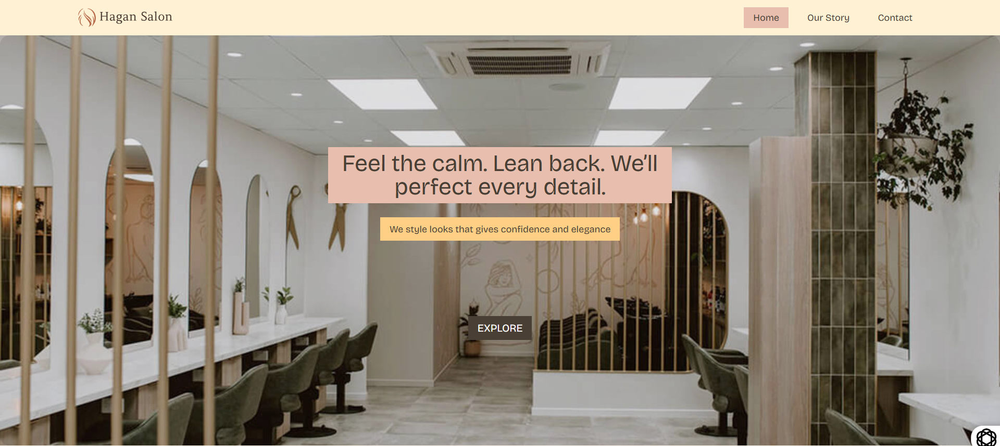
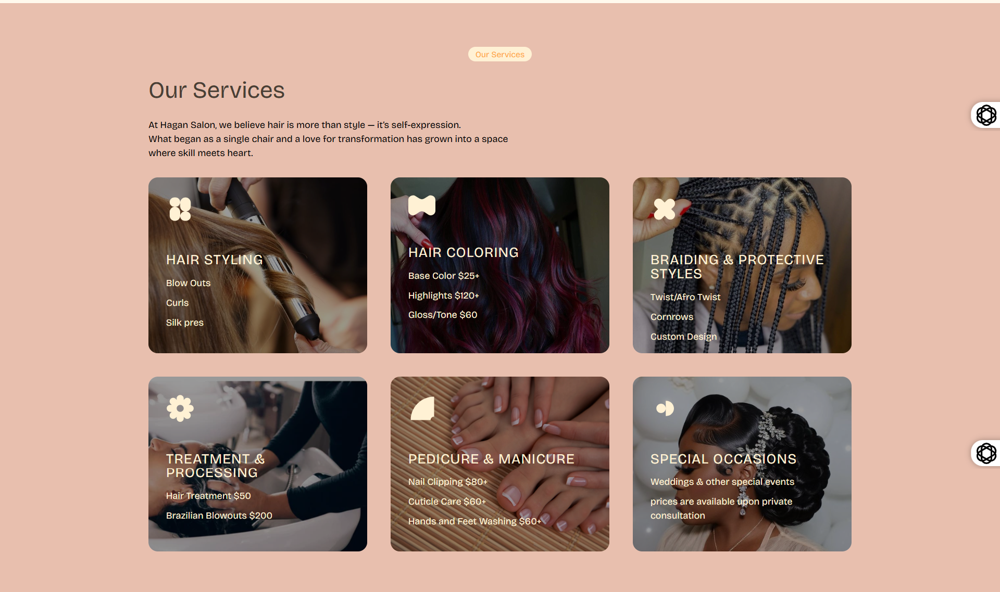

# Hagan Salon Website

A responsive salon website I designed and built as part of my journey in the 100Devs software engineering bootcamp.  
The project was created from scratch to practice HTML, CSS, and JavaScript while focusing on clean UI and responsive design.  
It showcases salon services, pricing, and a booking/contact section, making it a great portfolio piece to demonstrate both coding and design skills.

## Table of contents

- [Overview](#overview)
- [Live Demo](#live-demo)
- [Features](#Features)
- [My process](#my-process)
- [Built with](#Technologies-used)
- [What I learned](#what-i-learned)
- [Continued development](#continued-development)
- [Author](#author)
- [Acknowledgments](#acknowledgments)

## Overview

This project is a fully responsive salon website built to practice and showcase modern web development skills.  
The goal was to design and implement a clean, user-friendly interface that highlights salon services, pricing, and booking options.

The site adapts across devices using CSS Flexbox, Grid, and media queries, ensuring a seamless experience on desktop, tablet, and mobile.  
It was also a great opportunity to strengthen my JavaScript skills by adding interactivity and improving the overall user experience.

By combining both design and development, this project reflects my ability to take an idea from concept to execution — from creating the UI design to coding the final product.

### Live Demo

You can view the live version of the project here:  
👉 [Salon Website](https://sanyomor-01.github.io/hagan-salon/)



## My Process

- **Design:** I started by creating the UI design myself, focusing on a clean and modern look for a salon brand.
- **Development:** Built the site using HTML, CSS (Flexbox, Grid, media queries), and JavaScript for interactivity.
- **Responsiveness:** Tested and refined the layout across mobile, tablet, and desktop to ensure a seamless experience.
- **Deployment:** Published the site using GitHub Pages so it can be accessed online.

## Features

- Responsive design (works on mobile, tablet, and desktop)
- Homepage with hero section and call-to-action
- Services and pricing section
- Booking/contact form
- Gallery section

## Technologies Used

- Semantic HTML5 markup
- CSS custom properties
- Flexbox
- CSS Grid
- Mobile-first workflow

## 💻 Installation & Usage

If you want to run the project locally:

1. Clone the repository:
   ```bash
   git clone https://github.com/sanyomor-01/salon-website.git
   ```
2. Navigate to the project folder:

```bash
cd HAGAN-SALON
```

## What I learned

- Practiced responsive design principles in real-world scenarios.
- Improved skills with CSS layout techniques (Grid & Flexbox).
- Gained experience in structuring a project repo and writing a professional README.
- Understood the importance of combining design + development for better results.

## Continued development

- Add animations and smooth transitions.
- Create a functional booking form with backend integration.
- Expand with a gallery section showcasing salon styles.
- Improve accessibility (ARIA labels, color contrast).

## Author

- [LinkedIn](https://www.linkedin.com/in/michael-sanyomor/)
- [X Corp](https://x.com/sanyo_mor)

## Acknowledgments

- Thanks to 100Devs Bootcamp and [Leon Noel](https://x.com/leonnoel) for organizing this bootcamp and providing indepth knowledge in software development #We Go Get.
